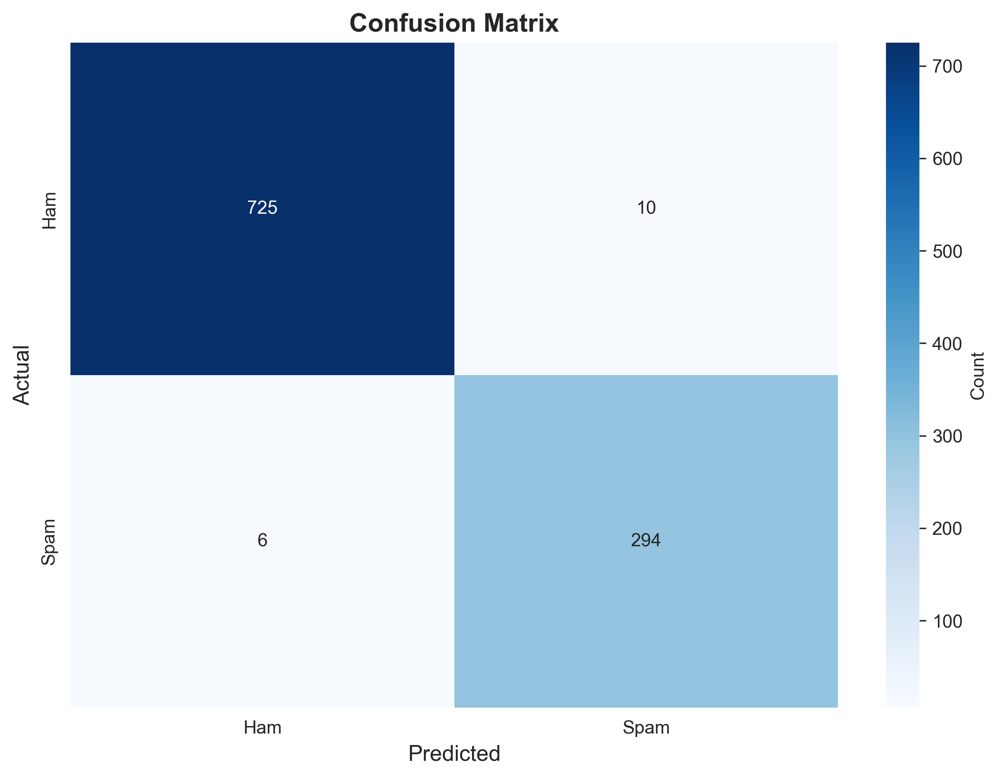
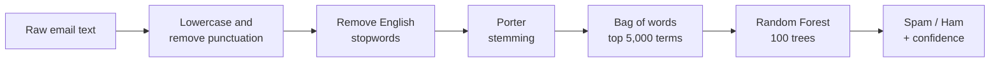
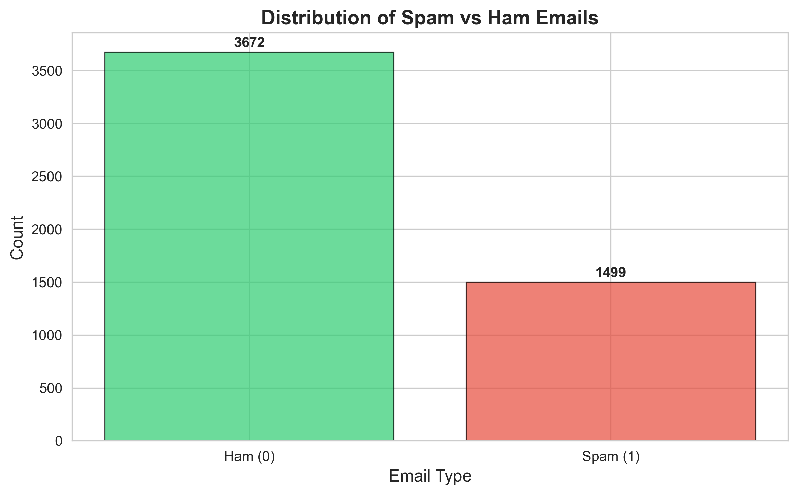
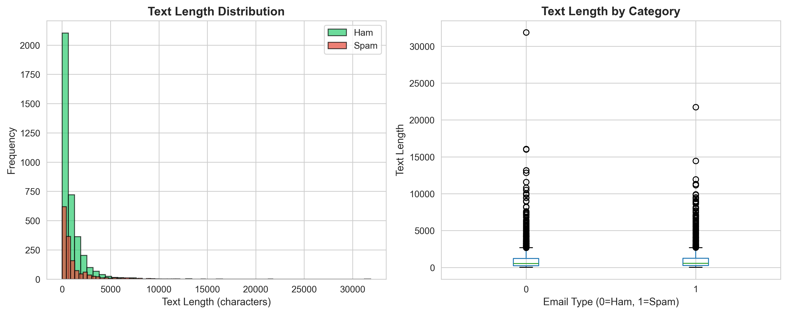
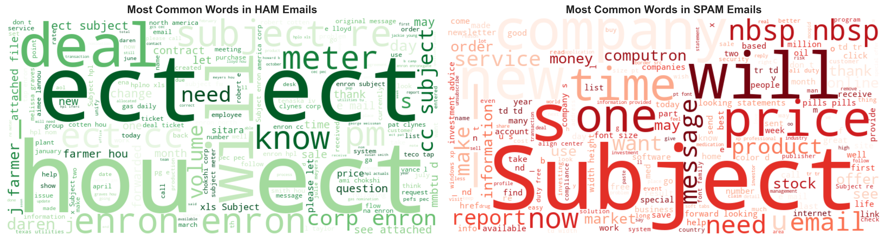
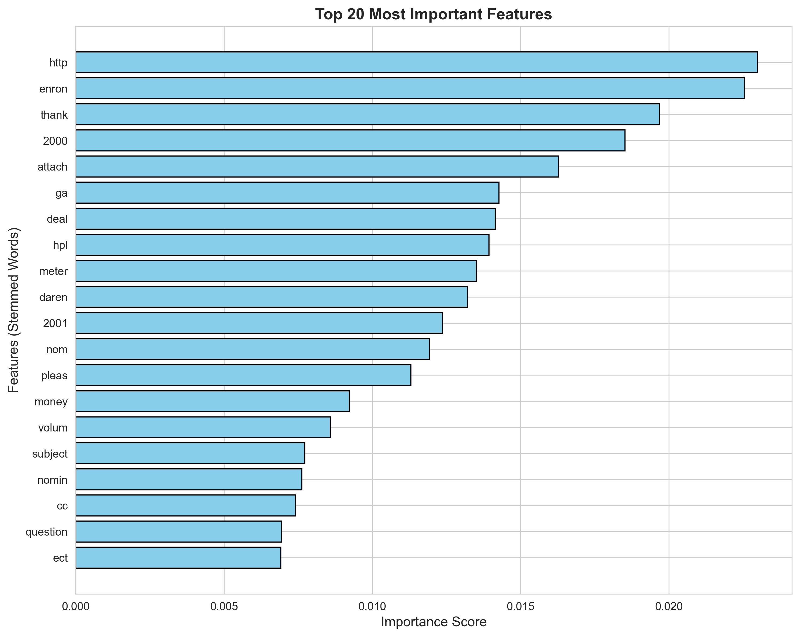

# Email Spam Detection

A spam classifier for email text, built with an NLP preprocessing pipeline and a Random Forest model. Trained and evaluated on 5,171 emails from the Enron corpus, it reaches **98.5% accuracy** on a held-out test set, with **98% of spam caught**.

---

## Results

Evaluated on a stratified 20% test set (1,035 emails):

| Metric | Ham | Spam |
|---|---|---|
| Precision | 99.2% | 96.7% |
| Recall | 98.6% | 98.0% |
| F1-score | 98.9% | 97.4% |

**Overall accuracy: 98.5%**

<p align="center">
  
</p>

Of 300 spam emails in the test set, 294 were caught and 6 slipped through. Of 735 legitimate emails, 10 were wrongly flagged as spam. For a spam filter, those false positives matter most: a missed spam email is an annoyance, but a legitimate email sent to the spam folder may never be read.

---

## Pipeline



| Stage | Implementation |
|---|---|
| Text cleaning | Lowercasing and punctuation removal |
| Stopword removal | NLTK English stopword list |
| Normalisation | Porter stemmer, so that *offer*, *offers* and *offering* count as one word |
| Vectorisation | `CountVectorizer` limited to the 5,000 most frequent terms |
| Model | `RandomForestClassifier`, 100 estimators |
| Evaluation | Stratified 80/20 split, preserving the spam/ham ratio in both sets |

---

## Dataset

The [Spam Mails Dataset](https://www.kaggle.com/datasets/venky73/spam-mails-dataset) from Kaggle, included in this repository as `spam_ham_dataset.csv`. It contains 5,171 emails from the Enron corpus: **3,672 ham (71%)** and **1,499 spam (29%)**.

<p align="center">
  
</p>

---

## Exploratory analysis

**Text length.** Spam and legitimate emails differ in length distribution, one of the patterns explored before modelling.



**Most frequent words.** Word clouds for each class show clearly different vocabularies.



**Most important features.** The 20 stemmed words the model relies on most.

<p align="center">
  
</p>

---

## Limitations

- **The model partly learns the corpus, not just spam.** Several of the most important features, such as *enron*, *hpl*, *daren* and *meter*, are specific to Enron's internal business emails. They help identify legitimate mail *in this dataset*, but mean nothing for an inbox outside Enron. Performance on other email sources would likely be lower than the scores above.
- **Duplicates may inflate the scores.** The dataset contains 268 duplicate email texts. Where a duplicate falls into both the training and the test set, the model is partly tested on emails it has already seen.
- **Vocabulary is built before the split.** The vectoriser is fitted on the full dataset, so the test set influences which 5,000 terms are kept. The effect is small here, but a production pipeline should fit it on training data only.
- **Word counts ignore context.** A bag-of-words model sees *free* the same way in "free trial" and "feel free to call", and cannot use sender, header or link information.

---

## Getting started

Requires Python 3.8+.

```bash
git clone https://github.com/JRBaiao/Email-Spam-Detection.git
cd Email-Spam-Detection
pip install -r requirements.txt
```

The NLTK stopword list is downloaded automatically the first time a script runs.

### Run

```bash
python visual_graph.py   # full pipeline: analysis charts, training, evaluation and a sample prediction
python main.py           # training, evaluation and a sample prediction only, no charts
```

Charts are saved as PNG files in the working directory. The copies shown in this README are in `img/`.

Results can vary slightly across library versions because of changes in scikit-learn's Random Forest implementation.

---

## Project structure

```
├── visual_graph.py          # Full pipeline with exploratory and evaluation charts
├── main.py                  # Lightweight training and evaluation script
├── spam_ham_dataset.csv     # Dataset (5,171 emails)
├── img/                     # Generated charts used in this README
├── requirements.txt
└── LICENSE
```

## Next steps

- Deduplicate the data and fit the vectoriser inside the training split, to get an unbiased performance estimate
- Remove corpus-specific terms, or test on a second email dataset, to measure how well the model generalises
- Compare against TF-IDF with logistic regression or Naive Bayes, the standard baselines for text classification
- Tune the decision threshold to reduce false positives, the costlier error for users
- Save the trained model and vectoriser so new emails can be classified without retraining
